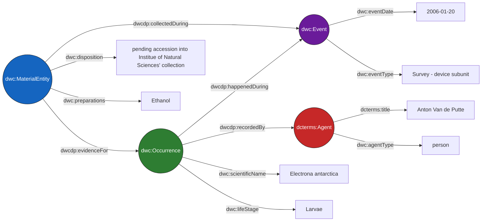

# Semantic Data Cloud

An application that allows SPARQL-based queries over biodiversity datasets using Darwin Core Conceptual Model semantics over Parquet-backed DuckDB views.

## Overview

Biodiversity data is commonly published as [Darwin Core Archives](https://ipt.gbif.org/manual/en/ipt/latest/dwca-guide#what-is-darwin-core-archive-dwc-a) distributed across institutional repositories. The newly proposed Darwin Core Data Package ([DwC-DP](https://www.gbif.org/composition/3Be8w9RzbjHtK2brXxTtun/introducing-the-darwin-core-data-package)) format introduces additional semantics and flexibility, but also increased complexity in data integration and querying. Querying across multiple such datasets typically requires either centralising the data or negotiating heterogeneous APIs.

The Darwin Core Conceptual Model ([DwC-CM](https://dwc.tdwg.org/cm/)), which is the basis for DwC-DP, is a highly interconnected data model. In this regard, it is well suited to graph representations, making the Resource Description Framework ([RDF](https://www.w3.org/TR/rdf11-primer/)) a clean, intuitive and semantically-rich data model. However, transforming tabular datasets into RDF represents a considerable Extract, Transform, Load (ETL) process and raises deduplication concerns, as the data must be maintained in both a relational database and a triplestore.

This project takes a different approach: data tables contained in each DwC-DP are hosted as Parquet files on object storage. On demand, a materialised DuckDB database of views is assembled from the relevant files and exposed through a SPARQL interface via a Virtual Knowledge Graph (VKG). Datasets can then be queried using a lightweight Web Ontology Language ([OWL](https://www.w3.org/TR/2012/REC-owl2-primer-20121211/)) ontology based primarily on [Darwin Core](https://dwc.tdwg.org/list/) terms, without any ETL step or permanent data duplication.

## Why a Semantic Data Cloud?

- **No data duplication.** Datasets stay on object storage as Parquet files. The application builds DuckDB views directly over them rather than downloading or copying rows into a local database, so the underlying data exists in exactly one place.
- **No ETL pipeline.** Datasets are queryable as soon as they're registered, no extract-transform-load step or intermediate format conversion is required, just pointing the application at the relevant Parquet assets.
- **Schema heterogeneity accommodation.** Datasets with differing numbers of tables and columns can be queried uniformly, without having to pad the Parquet data with empty columns or tables.
- **Entity- and relationship-based querying.** SPARQL lets users think in terms of entities (e.g. occurrences, events, agents, etc.) and how they relate to one another, rather than reasoning about foreign keys and join conditions.
- **Language-agnostic access.** Queries are submitted over plain HTTP, so any language or tool capable of making HTTP requests (e.g. Python, JavaScript, R, curl, etc.) can interact with the application.
- **Context-scoped, on-demand containers.** Spatial, temporal, and license filters resolve the relevant datasets before a query runs, so each context spins up only the database views and container it actually needs.

## Usage

The application brings the semantic expressivity of [RDF](https://www.w3.org/TR/rdf11-concepts/) and [the SPARQL 1.1 Query Language](https://www.w3.org/TR/2013/REC-sparql11-query-20130321/) to users, letting them declare exactly the data they need across related entities. For example, the following query retrieves occurrences of Antarctic lanternfish (*Electrona antarctica*) and their life stage, linked to material entities as evidence, along with the material entity's disposition, preparations, the event date, and the recording agent:

```sparql
PREFIX dcterms: <http://purl.org/dc/terms/>
PREFIX dwc: <http://rs.tdwg.org/dwc/terms/>
PREFIX dwcdp: <http://rs.tdwg.org/dwcdp/terms/>

SELECT ?lifeStage ?eventDate ?eventType ?disposition ?preparations ?preferredAgentName ?agentType

WHERE {
  ?occ a dwc:Occurrence ;
       dwc:scientificName "Electrona antarctica" ;
       dwc:lifeStage ?lifeStage ;
       dwcdp:happenedDuring ?evt ;
       dwcdp:recordedBy ?agt .

  ?evt a dwc:Event ;
       dwc:eventDate ?eventDate ;
       dwc:eventType ?eventType .

  ?mat a dwc:MaterialEntity ;
       dwc:disposition ?disposition ;
       dwc:preparations ?preparations ;
       dwcdp:evidenceFor ?occ ;
       dwcdp:collectedDuring ?evt .

  ?agt a dcterms:Agent ;
       dcterms:title ?preferredAgentName ;
       dwc:agentType ?agentType .
}
LIMIT 10
```

One solution to this query is shown below (data taken from the [BROKE-West fish](https://dwcdp-ipt.gbif-test.org/resource?r=broke-west-fish) dataset):



As this example illustrates, biodiversity data is inherently graph-structured, with rich relationships between occurrences, events, material entities, and agents that are difficult to represent in flat tables.

Queries are submitted as a JSON payload over [HTTP](https://datatracker.ietf.org/doc/html/rfc9110) to the `/sparql` endpoint. The SPARQL query should be contained in the `query` field of the JSON payload.

The request body can also include `bbox`, `temporal`, and `licenses` fields to narrow which datasets are loaded before the query runs, restricting the result, for instance, to only datasets that consider South American records from 2000 to 2015 and published under CC-BY-NC-4.0. See the [API reference](/docs/api.md) for the full request/response specification.

Each generated context also produces a citations file listing the source datasets used, in line with [the GBIF data user agreement](https://www.gbif.org/terms/data-user) and [GBIF's citation guidelines](https://www.gbif.org/citation-guidelines).

## Live instance

A live instance of the application is running, covering around 50 datasets across various domains, downloaded from [GBIF](https://www.gbif.org) and converted to the exploded Darwin Core Data Package format described in the [starter guide](/docs/starter.md) documentation. It is fully queryable and requires no installation or deployment.

The live instance exposes the following services/endpoints:

  - A SPARQL endpoint at: [https://data.qcbs.ca/sparql](https://data.qcbs.ca/sparql)
  - A metadata catalog at: [https://data.qcbs.ca/metadata-api](https://data.qcbs.ca/metadata-api)
  - An MCP server at: [https://data.qcbs.ca/mcp](https://data.qcbs.ca/mcp)

For example, the above query can be sent to the endpoint using [curl](https://curl.se/) with the following code:

```bash
curl -X POST https://data.qcbs.ca/sparql \
  -H "Content-Type: application/json" \
  -d '{"query": "PREFIX dcterms: <http://purl.org/dc/terms/> PREFIX dwc: <http://rs.tdwg.org/dwc/terms/> PREFIX dwcdp: <http://rs.tdwg.org/dwcdp/terms/> SELECT ?lifeStage ?eventDate ?eventType ?disposition ?preparations ?preferredAgentName ?agentType WHERE { ?occ a dwc:Occurrence ; dwc:scientificName \"Electrona antarctica\" ; dwc:lifeStage ?lifeStage ; dwcdp:happenedDuring ?evt ; dwcdp:recordedBy ?agt . ?evt a dwc:Event ; dwc:eventDate ?eventDate ; dwc:eventType ?eventType . ?mat a dwc:MaterialEntity ; dwc:disposition ?disposition ; dwc:preparations ?preparations ; dwcdp:evidenceFor ?occ ; dwcdp:collectedDuring ?evt . ?agt a dcterms:Agent ; dcterms:title ?preferredAgentName ; dwc:agentType ?agentType . } LIMIT 10"}'
```

The returned results will follow the standard [SPARQL 1.1 Query Results JSON format](https://www.w3.org/TR/sparql11-results-json/). The above command can be adapted to your favorite language and HTTP request library (e.g. [Requests](https://requests.readthedocs.io/en/latest/) in Python) or command-line tool (e.g. [Wget](https://www.gnu.org/software/wget/)).

More information about the considered datasets can be obtained by considering the metadata catalog, where full dataset EML data can be requested in JSON-LD format. For example, metadata about the BROKE-West dataset can be obtained by visiting [https://data.qcbs.ca/metadata-api/dataset/broke-west-fish](https://data.qcbs.ca/metadata-api/dataset/broke-west-fish).

Additionally, the deployment also offers a SPARQL-LLM chatbot, which consists of an open-source LLM with access to the SPARQL endpoint through the built-in Model Context Protocol ([MCP](https://modelcontextprotocol.io/docs/getting-started/intro)) server. Users may interact with it through the [chat interface](https://data.qcbs.ca/chat), which accepts natural language questions, builds and run the underlying SPARQL query for you and will answer back.

## Local deployment

The application is fully containerized using Docker. As long as [Docker](https://docs.docker.com/get-started/docker-overview/) and [Docker Compose](https://docs.docker.com/compose/) are installed, running the application is as simple as cloning the repository and starting the stack:

```bash
git clone https://github.com/QCBS/semantic-data-cloud
cd semantic-data-cloud
docker compose up --build
```

The application exposes three services:
  1. The SPARQL proxy at: [http://localhost:8000](http://localhost:8000)
  2. The EML metadata catalog at: [http://localhost:7788](http://localhost:7788)
  3. The MCP server at: [http://localhost:9000/mcp](http://localhost:9000/mcp)

To host your own datasets rather than connect to an existing bucket, see the [starter guide](/docs/starter.md) for how to prepare and upload Darwin Core Data Packages.

## Documentation

Additional, more detailed documentation can be found in the [`docs/`](/docs/) directory:
  - [Architecture](/docs/architecture.md), describing the overall architecture, components, design of the application.
  - [API reference](/docs/api.md), describing the endpoint specification and request/response formats.
  - [Ontology and mappings](/docs/ontology.md), describing the Darwin Core OWL ontology and OBDA mapping conventions.
  - [MCP server](/docs/mcp.md), describing a natural language interface via the Model Context Protocol.
  - [Starter guide](/docs/starter.md), for help regarding how to prepare and host Darwin Core Data Packages for use with the application.