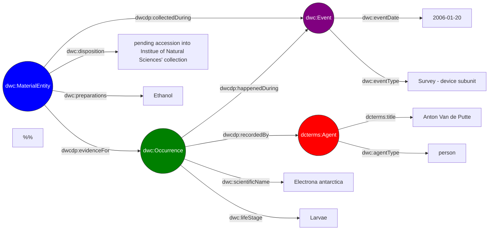

# Semantic Data Cloud

An application that allows SPARQL-based queries over biodiversity datasets using Darwin Core semantics over Parquet-backed DuckDB views.

## Overview

Biodiversity data is commonly published as [Darwin Core Archives](https://ipt.gbif.org/manual/en/ipt/latest/dwca-guide#what-is-darwin-core-archive-dwc-a) distributed across institutional repositories. The newly proposed [Darwin Core Data Package](https://www.gbif.org/composition/3Be8w9RzbjHtK2brXxTtun/introducing-the-darwin-core-data-package) format introduces additional semantics and flexibility, but also increased complexity in data integration and querying. Querying across multiple such datasets typically requires either centralising the data or negotiating heterogeneous APIs.

The [Darwin Core Conceptual Model](https://gbif.github.io/dwc-dp/cm/) is a highly interconnected data model. In this regard, it is well suited to graph representations, making the Resource Description Framework ([RDF](https://www.w3.org/TR/rdf11-primer/)) a clean, intuitive and semantically-rich data model. However, transforming tabular datasets into RDF represents a considerable Extract, Transform, Load (ETL) process and raises deduplication concerns, as the dataset must then exist in two different forms.

This project takes a different approach: data tables contained in each Data Package are hosted as Parquet files on object storage. On demand, a materialised DuckDB database is assembled from the relevant files and exposed through a SPARQL interface via a Virtual Knowledge Graph (VKG). Datasets can then be queried using a lightweight Web Ontology Language ([OWL](https://www.w3.org/TR/2012/REC-owl2-primer-20121211/)) ontology based primarily on [Darwin Core](https://dwc.tdwg.org/list/) terms, without any ETL step or permanent data duplication.

## Why a Semantic Data Cloud?

- **No data duplication.** Datasets stay on object storage as Parquet files. The application builds DuckDB views directly over them rather than downloading or copying rows into a local database, so the underlying data exists in exactly one place.
- **No ETL pipeline.** Datasets are queryable as soon as they're registered, no transform-and-load step or intermediate format conversion is required, just pointing the application at the relevant Parquet assets.
- **Schema heterogeneity accomodation.** Datasets with differing numbers of tables and columns can be queried uniformly, without having to pad the Parquet data with empty columns or tables.
- **Entity- and relationship-based querying.** SPARQL lets users think in terms of entities (e.g. occurrences, events, agents, etc.) and how they relate to one another, rather than reasoning about foreign keys and join conditions.
- **Language-agnostic access.** Queries are submitted over plain HTTP, so any language or tool capable of making HTTP requests (e.g. Python, JavaScript, R, curl, etc.) can interact with the application.
- **Context-scoped, on-demand resources.** Spatial, temporal, and license filters resolve the relevant datasets before a query runs, so each context spins up only the database views and container it actually needs.

## Usage

The application brings the semantic expressivity of [the SPARQL 1.1 Query Language](https://www.w3.org/TR/2013/REC-sparql11-query-20130321/) to users, letting them declare exactly the data they need across related entities. For example, the following query retrieves occurrences of Antarctic lanternfish (*Electrona antarctica*) and their life stage, linked to material entities as evidence, along with the material entity's disposition, preparations, the event date, and the recording agent:

```sparql
PREFIX dcterms: <http://purl.org/dc/terms/>
PREFIX dwc: <http://rs.tdwg.org/dwc/terms/>
PREFIX dwcdp: <http://rs.tdwg.org/dwcdp/terms/>

SELECT ?lifeStage ?eventDate ?eventType ?disposition ?preparations ?preferredAgentName ?agentType

WHERE {
  ?occ a dwc:Occurrence ;
       dwc:scientificName "Electrona antarctica" ;
       dwc:lifeStage ?lifeStage ;
       dwcdp:happenedDuring ?evt ;
       dwcdp:recordedBy ?agt .

  ?evt a dwc:Event ;
       dwc:eventDate ?eventDate ;
       dwc:eventType ?eventType .

  ?mat a dwc:MaterialEntity ;
       dwc:disposition ?disposition ;
       dwc:preparations ?preparations ;
       dwcdp:evidenceFor ?occ ;
       dwcdp:collectedDuring ?evt .

  ?agt a dcterms:Agent ;
       dcterms:title ?preferredAgentName ;
       dwc:agentType ?agentType .
}
LIMIT 10
```

One solution to this query is shown below (data taken from the [BROKE-West fish](https://dwcdp-ipt.gbif-test.org/resource?r=broke-west-fish) dataset):



As this example illustrates, biodiversity data is inherently graph-structured, with rich relationships between occurrences, events, material entities, and agents that are difficult to represent in flat tables.

Queries are submitted as JSON payload over [HTTP](https://datatracker.ietf.org/doc/html/rfc2616), following the [SPARQL 1.1 Protocol](https://www.w3.org/TR/sparql11-protocol/), to the `/sparql` endpoint:

```json
{
  "query": "PREFIX dcterms: <http://purl.org/dc/terms/> PREFIX dwc: <http://rs.tdwg.org/dwc/terms/> PREFIX dwcdp: <http://rs.tdwg.org/dwcdp/terms/> SELECT ?lifeStage ?eventDate ?eventType ?disposition ?preparations ?preferredAgentName ?agentType WHERE { ?occ a dwc:Occurrence ; dwc:scientificName \"Electrona antarctica\" ; dwc:scientificName ?lifeStage ; dwcdp:happenedDuring ?evt ; dwcdp:recordedBy ?agt . ?evt a dwc:Event ; dwc:eventDate ?eventDate ; dwc:eventType ?eventType . ?mat a dwc:MaterialEntity ; dwc:disposition ?disposition ; dwc:preparations ?preparations ; dwcdp:evidenceFor ?occ ; dwcdp:collectedDuring ?evt . ?agt a dcterms:Agent ; dcterms:title ?preferredAgentName ; dwc:agentType ?agentType . } LIMIT 10"
}
```

The request body can also include `bbox`, `temporal`, and `licenses` fields to narrow which datasets are loaded before the query runs, restricting the result, for instance, to only datasets that consider South American records from 2000 to 2015 published under CC-BY-NC-4.0. See the [API reference](/docs/api.md) for the full request/response specification.

Each generated context also produces a citations file listing the source datasets used, in line with [the GBIF data user agreement](https://www.gbif.org/terms/data-user) and [GBIF's citation guidelines](https://www.gbif.org/citation-guidelines).

## Local deployment

The application is fully containerized using Docker. As long as [Docker](https://docs.docker.com/get-started/docker-overview/) and [Docker Compose](https://docs.docker.com/compose/) are installed, running the application is as simple as cloning the repository and starting the stack:

```bash
git clone https://github.com/QCBS/semantic-data-cloud
cd semantic-data-cloud
docker compose up --build
```

The application exposes three services:
  1. The SPARQL proxy at: `http://localhost:8000`
  2. The EML metadata catalog at: `http://localhost:7788`
  3. The MCP server at: `http://localhost:9000`

Before starting the stack, create a `.env` file in the project root with credentials for the S3-compatible object storage hosting your datasets:

```env
OBJECT_STORE_BASE_URL=https://your-public-object-url-base
S3_ACCESS_ID=your_access_key_id
S3_ACCESS_SECRET=your_secret_access_key
S3_BUCKET_NAME=your_bucket_name
S3_ENDPOINT_URL=https://your-object-storage-endpoint
```

To host your own datasets rather than connect to an existing bucket, see the [starter guide](/docs/starter.md) for how to prepare and upload Darwin Core Data Packages.

## Documentation

Additional detailed documentation can be found in the [`docs/`](/docs/) directory:
  - [Architecture](/docs/architecture.md), describing the overall architecture, components, design of the application.
  - [API reference](/docs/api.md), describing the endpoint specification and request/response formats.
  - [Ontology and mappings](/docs/ontology.md), describing the Darwin Core OWL ontology and OBDA mapping conventions.
  - [MCP server](/docs/mcp.md), describing a natural language interface via the Model Context Protocol.
  - [Starter guide](/docs/starter.md), for help regarding how to prepare and host Darwin Core Data Packages for use with the application.