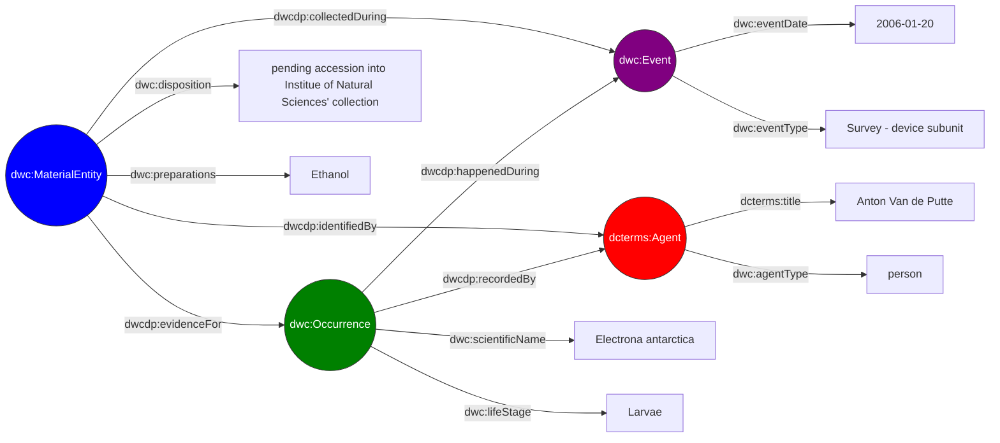

# Semantic Data Cloud

An application that allows SPARQL-based queries over biodiversity datasets using Darwin Core semantics over Parquet-backed DuckDB views.

## Overview

Biodiversity data is commonly published as [Darwin Core Archives](https://ipt.gbif.org/manual/en/ipt/latest/dwca-guide#what-is-darwin-core-archive-dwc-a) distributed across institutional repositories. The newly proposed [Darwin Core Data Package](https://www.gbif.org/composition/3Be8w9RzbjHtK2brXxTtun/introducing-the-darwin-core-data-package) format introduces additional semantics and flexibility, but also increased complexity in data integration and querying. Querying across multiple such datasets typically requires either centralising the data or negotiating heterogeneous APIs.

The [Darwin Core Conceptual Model](https://gbif.github.io/dwc-dp/cm/) is a highly interconnected data model. In this regard, it is well suited to graph representations, making the Resource Description Framework ([RDF](https://www.w3.org/TR/rdf11-primer/)) a clean, intuitive and semantically-rich data model. However, transforming tabular datasets into RDF represents a considerable Extract, Transform, Load (ETL) process and raises deduplication concerns, as the dataset must then exist in two different forms.

This project takes a different approach: data tables contained in each Data Package are hosted as Parquet files on object storage. On demand, a materialised DuckDB database is assembled from the relevant files and exposed through a SPARQL interface via a Virtual Knowledge Graph (VKG). Datasets can then be queried using a lightweight Web Ontology Language ([OWL](https://www.w3.org/TR/2012/REC-owl2-primer-20121211/)) ontology based primarily on [Darwin Core](https://dwc.tdwg.org/list/) terms, without any ETL step or permanent data duplication.

## Usage

The application brings the semantic expressivity of [the SPARQL 1.1 Query Language](https://www.w3.org/TR/2013/REC-sparql11-query-20130321/) to users. SPARQL is a highly expressive declarative query language that enables precise extraction of specific data across multiple related entities. Users can therefore focus on writing clean SPARQL queries to retrieve exactly the data they need.

For example, the following query retrieves occurrences of Antarctic lanternfish (*Electrona antarctica*) and their life stage that are linked to material entities as evidence, along with the material entity disposition, preparations, the event date as well as the name of the agent who recorded it:

```sparql
PREFIX dcterms: <http://purl.org/dc/terms/>
PREFIX dwc: <http://rs.tdwg.org/dwc/terms/>
PREFIX dwcdp: <http://rs.tdwg.org/dwcdp/terms/>

SELECT ?lifeStage ?eventDate ?eventType ?disposition ?preparations ?preferredAgentName ?agentType 

WHERE {
  ?occ a dwc:Occurrence ;
       dwc:scientificName "Electrona antarctica" ;
       dwc:scientificName ?lifeStage ;
       dwcdp:happenedDuring ?evt ;
       dwcdp:recordedBy ?agt .

  ?evt a dwc:Event ;
       dwc:eventDate ?eventDate ;
       dwc:eventType ?eventType .

  ?mat a dwc:MaterialEntity ;
       dwc:disposition ?disposition ;
       dwc:preparations ?preparations ;
       dwcdp:evidenceFor ?occ ;
       dwcdp:collectedDuring ?evt .

  ?agt a dcterms:Agent ;
       dcterms:title ?preferredAgentName ;
       dwc:agentType ?agentType .
}
LIMIT 10
```

This query illustrates the expressive power of SPARQL by traversing relationships between multiple entity types in a single declarative query pattern.

One solution to this query is shown below (data taken from the [BROKE-West fish](https://dwcdp-ipt.gbif-test.org/resource?r=broke-west-fish) dataset):



As this example illustrates, biodiversity data is inherently graph-structured, with rich relationships between occurrences, events, material entities, and agents that are difficult to represent in flat tables.

The application accepts SPARQL queries over [HTTP](https://datatracker.ietf.org/doc/html/rfc2616) following the [SPARQL 1.1 Protocol](https://www.w3.org/TR/sparql11-protocol/). Queries are submitted as JSON in the body of a POST request to the `/sparql` endpoint. For example, the following JSON payload submits the previous query to the `/sparql` endpoint:

```json
{
  "query": "PREFIX dcterms: <http://purl.org/dc/terms/> PREFIX dwc: <http://rs.tdwg.org/dwc/terms/> PREFIX dwcdp: <http://rs.tdwg.org/dwcdp/terms/> SELECT ?lifeStage ?eventDate ?eventType ?disposition ?preparations ?preferredAgentName ?agentType WHERE { ?occ a dwc:Occurrence ; dwc:scientificName \"Electrona antarctica\" ; dwc:scientificName ?lifeStage ; dwcdp:happenedDuring ?evt ; dwcdp:recordedBy ?agt . ?evt a dwc:Event ; dwc:eventDate ?eventDate ; dwc:eventType ?eventType . ?mat a dwc:MaterialEntity ; dwc:disposition ?disposition ; dwc:preparations ?preparations ; dwcdp:evidenceFor ?occ ; dwcdp:collectedDuring ?evt . ?agt a dcterms:Agent ; dcterms:title ?preferredAgentName ; dwc:agentType ?agentType . } LIMIT 10"
}
```

Because SPARQL queries are sent as HTTP requests, any programming language or tool capable of making HTTP requests can interact with the application, including:

- Python: [Requests](https://requests.readthedocs.io/), [HTTPX](https://www.python-httpx.org/), or the standard library [urllib](https://docs.python.org/3/library/urllib.request.html).
- Ruby: [Faraday](https://lostisland.github.io/faraday/), [HTTParty](https://github.com/jnunemaker/httparty), or the standard gem [HTTP](https://ruby-doc.org/stdlib-2.7.0/libdoc/net/http/rdoc/Net/HTTP.html).
- JavaScript: [ky](https://github.com/sindresorhus/ky), [Axios](https://axios-http.com/), or the standard [Fetch](https://developer.mozilla.org/en-US/docs/Web/API/Fetch_API/Using_Fetch).
- R: [httr2](https://httr2.r-lib.org/), [crul](https://docs.ropensci.org/crul/) or [curl](https://jeroen.r-universe.dev/curl).
- Rust: [reqwests](https://docs.rs/reqwest/latest/reqwest/), or [hyper](https://hyper.rs/).
- Elixir: [Req](https://req.hexdocs.pm/Req.html), or [Finch](https://finch.hexdocs.pm/0.23.0/Finch.html).
- Lua: [LuaSocket](https://lunarmodules.github.io/luasocket/), or [lua-http](https://daurnimator.github.io/lua-http/0.4/).
- Command line: [curl](https://curl.se/) or [wget](https://www.gnu.org/software/wget/).

The above list is not meant to be exhaustive, but rather to highlight the broad range of tools and programming languages that can be used to interact with the application. As long as a client can make standard HTTP requests, it can submit SPARQL queries and process the results.

## Additional functionality

In addition to creating complete collection of datasets, the application can generate filtered dataset subsets based on user-defined criteria. The following filters are currently supported:

- **Spatial filtering**: Provide a bounding box of coordinates to include only datasets whose spatial coverage intersects the specified area.
- **Temporal filtering**: Provide a date range to include only datasets whose temporal coverage intersects the specified period.
- **License filtering**: Provide one or more license identifiers to include only datasets published under the selected licenses.

Optional filters can narrow which datasets are loaded before the query runs, which means that the application accepts the following JSON objects:

```json
{
  "query": "...",
  "bbox": [min_lon, min_lat, max_lon, max_lat],
  "temporal": ["YYYY-MM-DD", "YYYY-MM-DD"],
  "licenses": ["CC-BY-4.0", "CC0-1.0"]
}
```

When generating a subset, the application reads only the data required from the source Parquet files stored in object storage. It then creates an isolated, context-specific Docker container that enables efficient querying and processing of the selected data.

For example, a query considering only datasets that consider data in South American data between 2000 and 2015, and that bear the CC-BY-NC-4.0 license can simply be obtained as:

```json
{
  "query": "...",
  "bbox": [-82.0, -56.0, -34.0, 13.5],
  "temporal": ["2000-01-01", "2015-12-31"],
  "licenses": ["CC-BY-NC-4.0"]
}
```

### Data provenance and attribution

Each generated container includes a `{ctx_hash}-citations.txt` file containing the citations associated with the datasets used to build that context. This ensures, traceability of the source datasets, proper attribution of data providers and ompliance with GBIF data usage requirements. The approach follows [the GBIF data user agreement](https://www.gbif.org/terms/data-user) and [GBIF citation guidelines](https://www.gbif.org/citation-guidelines).

## Local deployment

The application is fully containerized using Docker. As long as [Docker](https://docs.docker.com/get-started/docker-overview/) and [Docker Compose](https://docs.docker.com/compose/) are installed, running the application is as simple as cloning the repository and starting the stack with Docker Compose:

```bash
git clone https://github.com/QCBS/semantic-data-cloud
cd semantic-data-cloud
docker compose up --build
```

The application exposes three services:
  1. The SPARQL proxy at: `http://localhost:8000`
  2. The EML metadata catalog at: `http://localhost:7788`
  3. The MCP server at: `http://localhost:9000`

For more details on the how to interact with these services, please consult the [API reference](/docs/api.md) and [MCP server](/docs/mcp.md) documentation.

### Storage layout

Datasets are stored in object storage as directory-like prefixes, where each dataset is represented as a self-contained Darwin Core Data Package in exploded Parquet form. An example structure layout is as shown below:

```
datasets/
├── dataset_a/
│   ├── eml.json
│   ├── event.parquet
│   ├── identification.parquet
│   ├── occurrence.parquet
│   └── occurrence-assertion.parquet
├── dataset_b/
│   ├── eml.json
│   ├── event.parquet
│   └── material.parquet
└── dataset_c/
    ├── eml.json
    ├── event.parquet
    ├── event-assertion.parquet
    └── occurrence.parquet
```

Each top-level directory under `datasets/` represents a single dataset (i.e., a Darwin Core Data Package). The presence of an `eml.json` file provides the required metadata for discovery and attribution.

All tables are stored as Parquet files, corresponding to Darwin Core tables (e.g., `event`, `identification`, `occurrence`) in the `.csv` (though they are technically `.tsv`) files contained in the Darwin Core Data Package. This layout is corresponds to an "exploded" representation of a Darwin Core Data Package, designed for columnar access and efficient partial loading in DuckDB without requiring transformation into RDF or a centralized warehouse.

### Environment configuration

To enable access to files stored in the S3-compatible object storage service and to communicate with the backend API, create a `.env` file in the project root containing the following variables:

```env
OBJECT_STORE_BASE_URL=https://your-public-object-url-base
S3_ACCESS_ID=your_access_key_id
S3_ACCESS_SECRET=your_secret_access_key
S3_BUCKET_NAME=your_bucket_name
S3_ENDPOINT_URL=https://your-object-storage-endpoint
```

The S3-related variables provide the credentials and connection details required to access the object storage bucket that hosts application files. Particularly, `OBJECT_STORE_BASE_URL` specifies the public URL used to retrieve stored objects.

By default, the EML metadata catalog is exposed on port `7788`. This can be overridden by setting the optional environment variable `METADATA_API_PORT` to the desired value port value.

## Documentation

Additional detailed documentation can be found in the [`docs/`](/docs/) directory:
  - [Architecture](/docs/architecture.md) describing the overall architecture and design of the application.
  - [API reference](/docs/api.md), describing the endpoint specification and request/response formats.
  - [Ontology and mappings](/docs/ontology.md), describing the Darwin Core OWL ontology and OBDA mapping conventions.
  - [MCP server](/docs/mcp.md), describing a natural language interface via the Model Context Protocol.
  - [Starter guide](/docs/starter.md), for help regarding how to prepare and host Darwin Core Data Packages for use with the application.
